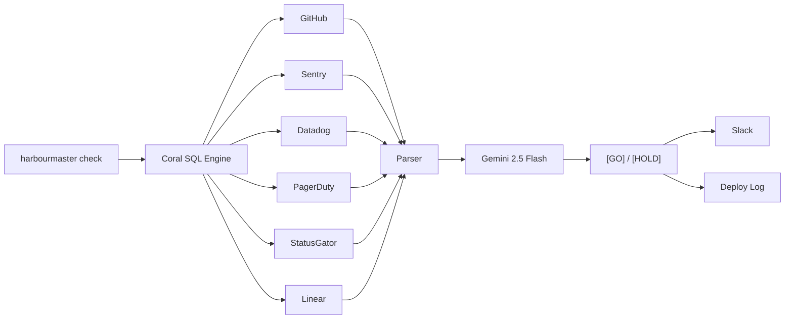

<div align="center">

# Harbourmaster

### Deploy Readiness Intelligence Agent

**6 sources. One verdict. Under 10 seconds.**

[](https://withcoral.com)
[](https://aistudio.google.com)
[](https://typescriptlang.org)

</div>

---

## The Problem

Every engineer who deploys software asks themselves: *"Is right now a good time to ship?"*

Answering that correctly requires checking **6 different tools manually** — and teams routinely skip checks because it takes too long (10–16 minutes per deploy).

**Harbourmaster eliminates that friction entirely.**

```
harbourmaster check --service payments-service --release v2.4.1
```

One command. Six sources. One confident verdict.

---

## How It Works



### What Each Source Checks

| Source | Question Answered |
|--------|-------------------|
| **GitHub** | Did CI pass? Are all release PRs merged? |
| **Sentry** | Is the error rate elevated vs. the 24h baseline? |
| **Datadog** | Are any infrastructure monitors in alert? |
| **PagerDuty** | Is there an active incident right now? |
| **StatusGator** | Are third-party dependencies (Stripe, AWS) degraded? |
| **Linear** | Are all issues in this release milestone closed? |

---

## Terminal Output

```
╭──────────────────────────────────────────────────╮
│  HARBOURMASTER CHECK                             │
│  service: payments-service   release: v2.4.1     │
╰──────────────────────────────────────────────────╯

  [PASS] GitHub       All 4 release PRs merged. CI passed on main (3m ago).
  [WARN] Sentry       Error rate 1.4× above 24h baseline. No new fatals.
  [PASS] Datadog      All 5 monitors green.
  [FAIL] PagerDuty    ACTIVE INCIDENT · "Auth service degraded" · P2 · 14m
  [PASS] StatusGator  Stripe ✓  Twilio ✓  AWS ✓  All operational.
  [PASS] Linear       7/7 issues in "Release v2.4.1" closed.
  ──────────────────────────────────────────────────────────
  Risk Score:  ████████████████████████░░░░░░  78/100

╭──────────────────────────────────────────────────╮
│  [HOLD]  ·  high confidence                      │
│                                                  │
│  PagerDuty shows an active P2 incident on the    │
│  auth service that began 14 minutes ago.         │
│  Deploying into an active incident risks masking │
│  the current root cause investigation.           │
│                                                  │
│  On-call: @sarah (payments)  @devraj (auth)      │
╰──────────────────────────────────────────────────╯

  Checked 6 sources via Coral in 4.2s
  3:42 PM · payments-service · v2.4.1
```

---

## Quick Start

### Prerequisites

- [Node.js v20+](https://nodejs.org)
- [Coral CLI](https://withcoral.com/docs) (installed via `brew install withcoral/tap/coral` in WSL)
- [Gemini API Key](https://aistudio.google.com) (free)

### Setup

```bash
# 1. Clone and install
git clone https://github.com/your-username/harbourmaster.git
cd harbourmaster
npm install

# 2. Configure environment
cp .env.example .env
# Edit .env and add your API keys

# 3. Configure Coral sources (in WSL)
coral source add --interactive github
coral source add --interactive sentry
coral source add --interactive datadog
coral source add --interactive pagerduty
coral source add --interactive statusgator
coral source add --interactive linear
coral source add --interactive slack

# 4. Seed test data (optional)
npm run seed:sentry
npm run seed:pagerduty
npm run seed:linear

# 5. Run a check
npx tsx src/index.ts check --service payments-service --release v2.4.1
```

---

## Commands

### `harbourmaster check`

Run a deploy readiness check.

```bash
harbourmaster check [options]

Options:
  -s, --service <name>      Service name (default: "payments-service")
  -r, --release <version>   Release milestone (default: "v2.4.1")
  -b, --branch <name>       Git branch (default: "main")
  --no-slack                Skip Slack notification
  --json                    Output as JSON for CI/CD integration
```

### `harbourmaster watch`

Continuously monitor deploy readiness.

```bash
harbourmaster watch [options]

Options:
  -i, --interval <seconds>  Check interval (default: 30)
  (same options as check)
```

### `harbourmaster history`

View past deploy checks.

```bash
harbourmaster history -n 20
```

---

## Architecture

```
harbourmaster/
├── src/
│   ├── index.ts              # CLI entry point (Commander)
│   ├── types.ts              # TypeScript interfaces
│   ├── coral/
│   │   ├── query.ts          # Coral SQL query builder
│   │   └── parser.ts         # Coral output → ReadinessSnapshot
│   ├── gemini/
│   │   └── verdict.ts        # Gemini verdict synthesizer
│   ├── output/
│   │   ├── terminal.ts       # Rich terminal renderer
│   │   └── slack.ts          # Slack notifications
│   └── log/
│       └── deployLog.ts      # JSON deploy history
├── scripts/
│   ├── seed-sentry.ts        # Seed Sentry with test errors
│   ├── seed-pagerduty.ts     # Seed PagerDuty with incidents
│   └── seed-linear.ts        # Seed Linear with issues
└── .github/
    └── workflows/
        └── harbourmaster.yml  # GitHub Action integration
```

---

## Risk Score

Harbourmaster computes a weighted risk score (0–100):

| Range | Verdict | Meaning |
|-------|---------|---------|
| 0–30 | **[GO]** | Safe to deploy |
| 31–60 | **[CAUTION]** | Deploy with awareness |
| 61–100 | **[HOLD]** | Do not deploy |

Source weights: PagerDuty (25%), GitHub (20%), Sentry (20%), Datadog (15%), StatusGator (10%), Linear (10%).

---

## Built For

**Pirates of the Coral-bean Hackathon** — WeMakeDevs × Coral  
Track 1: Enterprise Agent

---

## License

MIT

